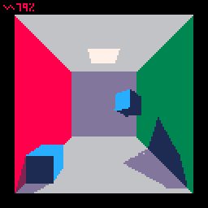
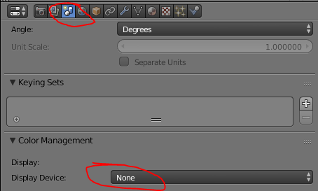
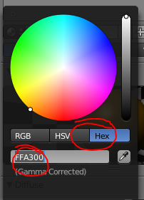
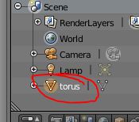

# pico8-shadows
Real-time 3d shadows on pico8 virtual console



Online version available [here](https://www.lexaloffle.com/bbs/?tid=32879)

## Dev log
Project started following a question on 3d clipping on BBS forums and quickly degenerated into a full blown 3d renderer with support for real-time shadows.
The technique used is similar to this classic paper: http://people.csail.mit.edu/ericchan/bib/pdf/p275-atherton.pdf

The shadows are globals (e.g. self-shadowing is supported, see torus scene).

Performance warning: the program is relatively well optimized, yet some area could be made a lot faster:
* global vertex buffer when performing model-view matrix transform
* smart clipping (e.g. use face/object clipping information to narrow clipping planes)

## Toolchain
3d models are exported from Blender and exported to a custom format using a Python script. Details below:

### Blender setup

Remove color remapping to use native pico8 colors:



### How to create a new model
:warning: limit your model to a dozen a faces - shadows computation is o(faces^2)!

:warning: only a single model is supported per Blender file

Create a regular Blender model.

Create face material using pico-8 hexa colors. Example orange material:



Name the model using only [a-z_] characters. This is the name used to reference the model in pico8.



:warning: The model must be zero centered and vertices coordinates must be within [-3,3] units.

### Export model

Update  [run_export.py](models/run_export.py]) script to reflect model filenames.
````
file_list = ['cornell','torus','cube']
````

The script assumes Blender is installed under "%programfiles%/Blender Foundation/Blender" (on Windows). Adjust as necessary for your platform.

The script runs on Python 2.7 and produces the following:

````
Exporting: cornell.blend
Exporting: torus.blend
Exporting: cube.blend
__gfx__
3070e0a1d19101717110c002020202020e0e020e0e0202020e02020e0e0e0e0e0e0e02360e36360ed9d90e36d90ed9906000004010403020600000405090b080
30000040102060508000004030408070d0000040508040107000004090a0c0b06000004070c0a0606000004060a090506000004080b0c07090080a080806080a
080806080808080a08060808060808060808060850f1a1d102e110903ac608892797892778088a0808c99708c978d5c608862797862778909000104010405020
90001040205060309000104010306040900010404070805090001040508090609000104060907040900010407010208090001040802030909000104090301070
9059c8b646070859c859b6c8b6c90708b6c8590886b6080a0808865940e002d001108007070707090707070907090909070709090709070909090960c0001040
10204030c000104030408070c000104070806050c000104050602010c000104030705010c0001040804020606006080808080a0a0808080806080608080a08
````

Edit (cornel_box)[carts/cornell_box.p8]

Copy the part below ````__gfx__```` at memory offset 0x1000 (e.g. starts at 0/128 in spritesheet)

### Use model

Add a new actor (or update an existing one) in lua code:

````
local all_actors={	
	another_actor={
		model="my_model",
		update=nop
	},
    ...
````

Create the new actor in ````_init```` function:

````
function _init()

	unpack_models()

	cam=make_cam(64,64,64)

	make_actor(all_actors.ground,{0,0,0})
	-- use new actor
    make_actor(all_actors.another_actor,{0,0,0})

	--
	plyr=make_plyr(0,0,6.5,0.5)		
end
````


